# Generating insights about Deforestation across regions using SQL

----
## Introduction
Deforestation is one of the main causes of climate change and global warming. This analysis looks into the occurrence of deforestation in various countries across different regions of the world. Data sets giving details of Deforestation activities across board were used in this analysis. Structured Query Language (SQL) was employed in this task to  create a new database, import these datasets and  generate insights from these datasets. Three sets of data presented in Excel format, were used in this analysis. They were imported into a database named 'PROJECT' . They are; 
- forest_area dataset (https://github.com/SeunA88/Generating-insights-about-Deforestation-across-regions-using-SQL/blob/main/forest_area_(1)%5B1%5D.csv)
- Land_area dataset (https://github.com/SeunA88/Generating-insights-about-Deforestation-across-regions-using-SQL/blob/main/land_area_(1)%5B1%5D.csv)
- Regions_ dataset (https://github.com/SeunA88/Generating-insights-about-Deforestation-across-regions-using-SQL/blob/main/regions_(1)%5B1%5D.csv)

From these data sets, the following insights were generated:
- Total number of countries involved in deforestation.
- The income groups of countries having total area ranging from 75,000 to 150,000 square meter.
- The average area in square miles for countries in the 'upper middle income region'. The result was compared to the rest of the income categories.
- The total forest area in square km for countries in the 'high income' group.  The result was compared to the rest of the income categories.
- The countries from each region (continent) having the highest total forest areas. 

## Analysis of Datasets

- **Overview of the datasets.**
  
The datasets show the deforestation details of about 217 countries in the world from the year 1990 to year 2016. The countries were divided into four income groups; low income, high income, upper middle income and lower middle income groups/categories, and seven regions or continents including East Asia & Pacific, Europe & Central Asia, Latin America & Caribbean, Middle East & North Africa, North America, South Asia and Sub-Saharan Africa. The country Monaco has the smallest total area by square miles while Russian Federation has the largest. Faroe Islands has the smallest forest area by square kilometre while Russian Federation has the largest.

---

- **A new database "PROJECT" was created and the 3 datasets were selected to view the columns therein.**

#### Below are the queries used for this analysis and their results:

---

- **Total number of countries involved in deforestation.**
  
To generate this insight the following steps were carried out:
1. The dataset Region_ was used.
2. Distinct countries were selected.
3. Aggregate function "COUNT" was used for this analysis to count the total number of countries.
   

#### Below are the queries used for this analysis and their results:
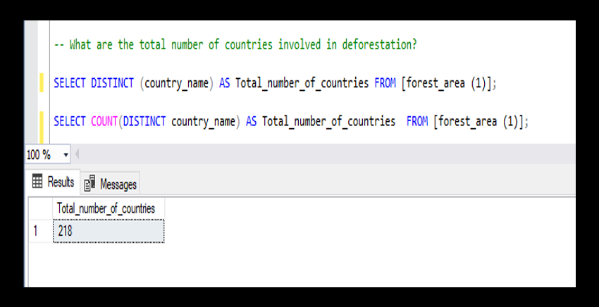

Please note: 217 distinct countries were analysed, the 218th in the dataset was noted as 'World'

---
   
- **The income groups of countries having total area ranging from 75,000 to 150,000 square meter**.
  
To generate this insight the following steps were carried out:
1. Two datasets were used; Land_area and Region_ dataset.
2. The total area in square miles column was checked for presence of null values.
3. All null values were replaced with the average total area in square miles. 
4. Then the two datasets were joined using JOIN function and filtered to get the results.
5. Further analysis was carried out to select distinct results and order the results.

#### Below are the queries used for this analysis and their results:

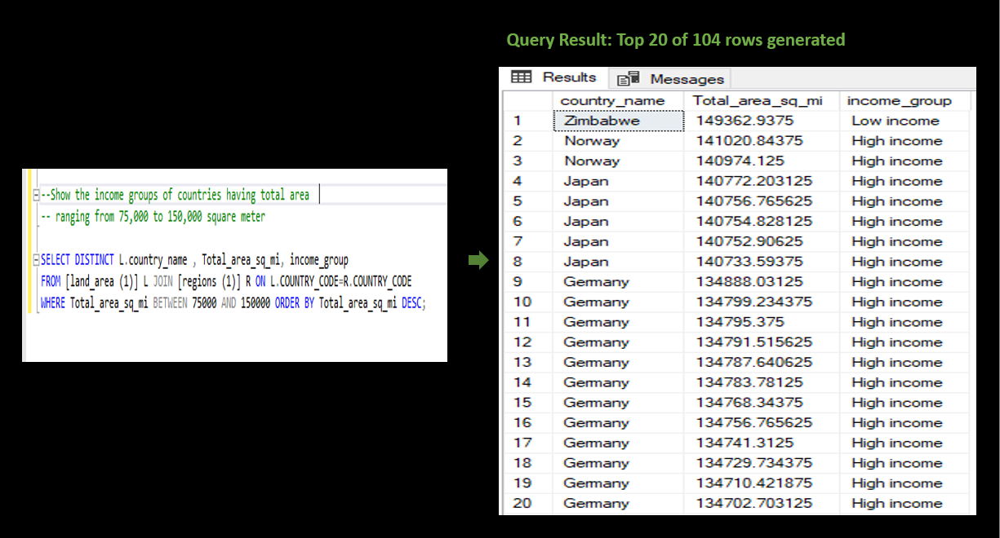

---

- **The average area in square miles for countries in the 'upper middle income region'. The result was compared to the rest of the income categories**.

To generate this insight the following steps were carried out:
1. Two datasets were used; Land_area and Region_ dataset.
2. The average total area in square miles was calculated using AVERAGE function and was used inconjustion with the GROUP BY clause.  
3. Then the two datasets were joined using JOIN function and filtered to get the results.
4. WHERE clause or HAVING clause was used to filter the datasets to get the result for 'upper middle income' region.
5. The same steps were carried out for the other income groups/categories.

#### Below are the queries used for this analysis and their results:
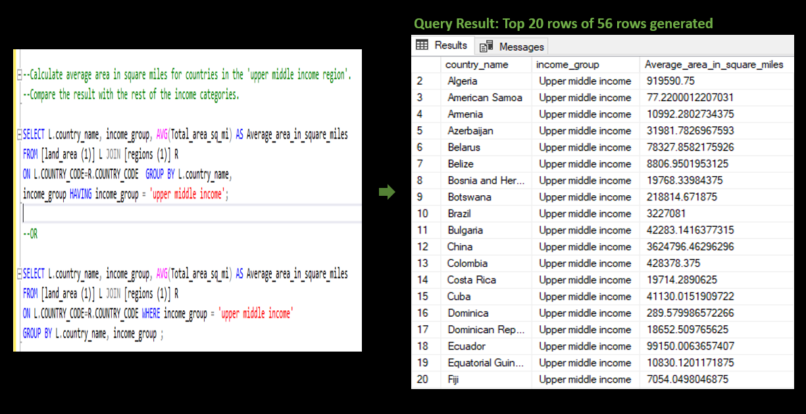

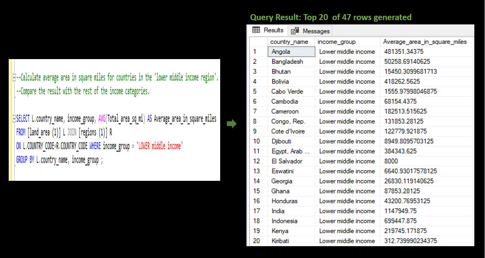

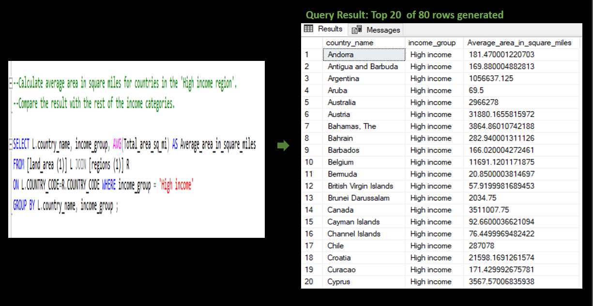

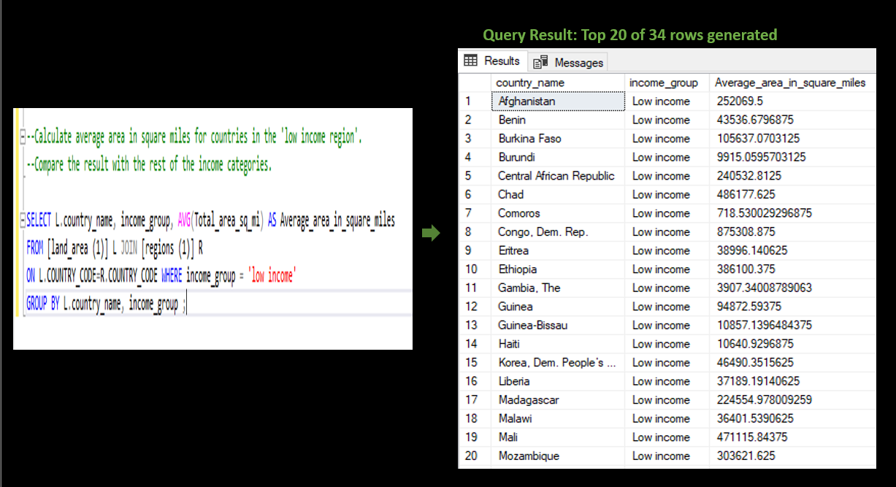

---

- **The total forest area in square km for countries in the 'high income' group.  The result was compared to the rest of the income categories**.

   To generate this insight the following steps were carried out:
1. Two datasets were used; forest_area and Region_ dataset.
2. The forest area in square km column was checked for presence of null values.
3. All null values were replaced with the average forest area in square km. 
3. The total forest area in square km for countries was calculated using SUM function and was used in conjustion with the GROUP BY clause.  
4. Then the two datasets were joined using JOIN function and filtered to get the results.
5. WHERE clause or HAVING clause was used to filter the datasets to get the result for 'high income' region.
6. The same steps were carried out for the other income groups/categories.

#### Below are the queries used for this analysis and their results:
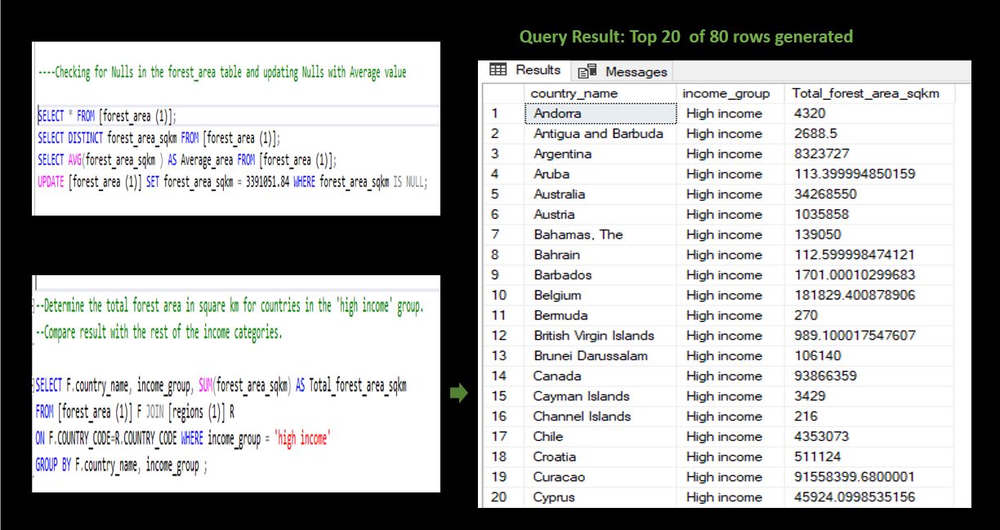

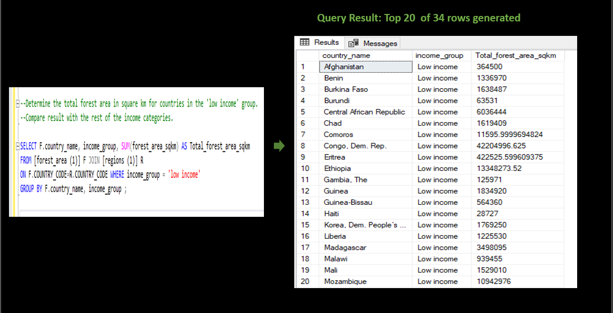

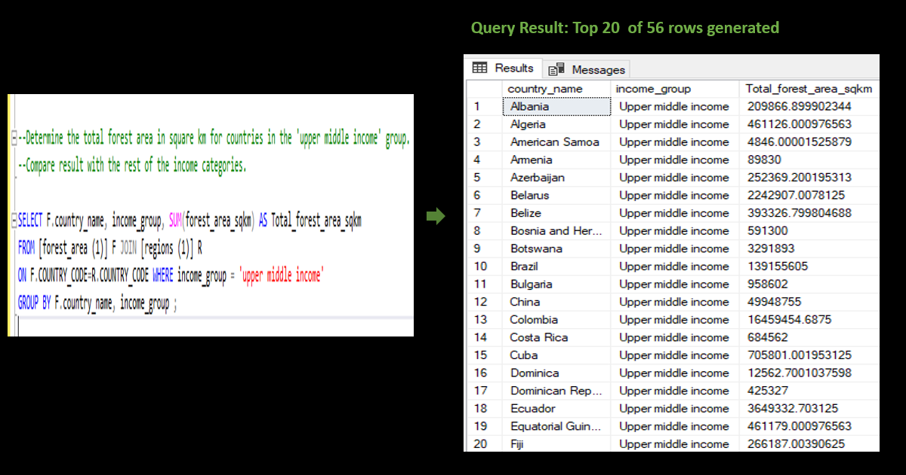

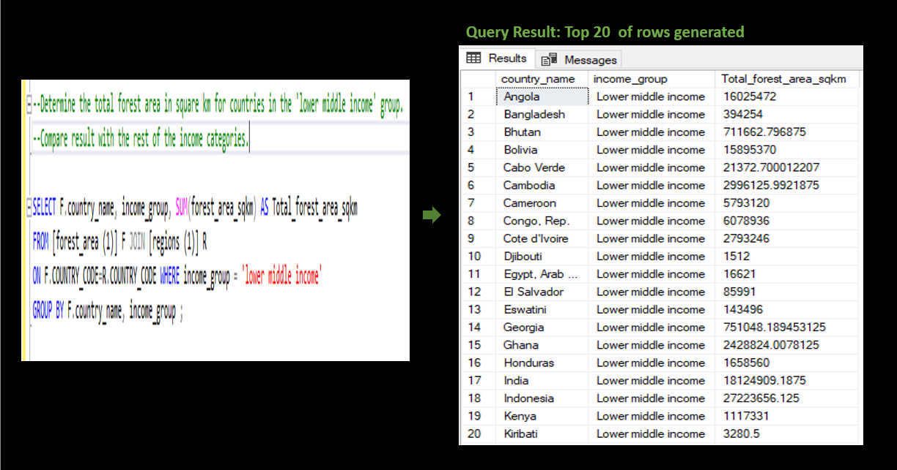

---

- **The countries from each region (continent) having the highest total forest areas.** 

To generate this insight the following steps were carried out:
1. Two datasets were used; forest_area and Region_ dataset.
2. The total forest area in square km for countries was calculated using SUM function and was used in conjustion with the GROUP BY clause.  
3. The two datasets were joined using JOIN function and filtered to get the results.
4. Functions like RANK and SUBQUERY was used to achieve the result.

#### Below are the queries used for this analysis and their results:
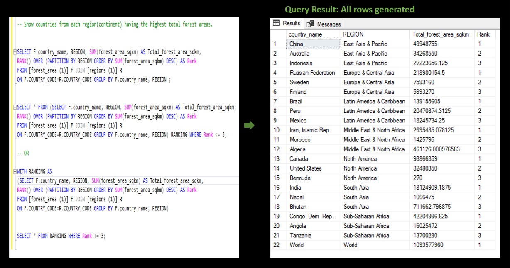

---

## Conclusion
SQL is a great tool in relating with datasets, retrieving data and generating useful insights from them. This analysis is a good illustration to the various functions that can be used for data analysis in SQL. Insights generated from this deforestation analysis can generate useful information that would help design remedies towards deforestaion problems and hereby avert all damages resulting from the aftermath of deforestation.
