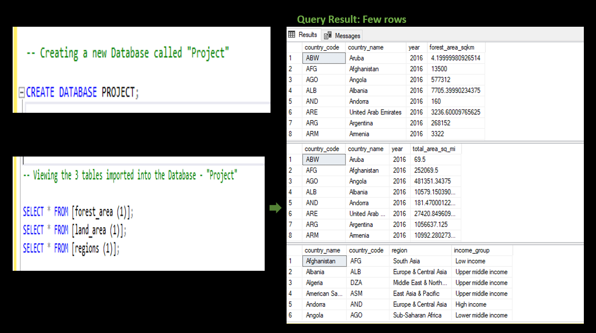

# Generating insights about Deforestation across regions using SQL

----
## Introduction
Deforestation is one of the main causes of climate change and global warming. This analysis looks into the occurrence of deforestation in various countries across different regions of the world. Data sets giving details of Deforestation activities across board were used in this analysis. Structured Query Language (SQL) was employed in this task to  create a new database, import these datasets and  generate insights from these datasets. Three sets of data presented in Excel format, were used in this analysis. They were imported into a database named 'PROJECT' . They are; 
- forest_area dataset (https://github.com/SeunA88/Generating-insights-about-Deforestation-across-regions-using-SQL/blob/main/forest_area_(1)%5B1%5D.csv)
- Land_area dataset (https://github.com/SeunA88/Generating-insights-about-Deforestation-across-regions-using-SQL/blob/main/land_area_(1)%5B1%5D.csv)
- Regions_ dataset (https://github.com/SeunA88/Generating-insights-about-Deforestation-across-regions-using-SQL/blob/main/regions_(1)%5B1%5D.csv)

From these data sets, the following insights were generated:
- Total number of countries involved in deforestation.
- The income groups of countries having total area ranging from 75,000 to 150,000 square meter.
- The average area in square miles for countries in the 'upper middle income region'. The result was compared to the rest of the income categories.
- The total forest area in square km for countries in the 'high income' group.  The result was compared to the rest of the income categories.
- The countries from each region (continent) having the highest total forest areas. 

## Analysis of Datasets

- **A new database "PROJECT" was created and the 3 datasets were selected to view the columns therein.**

#### Below are the queries used for this analysis and their results:

---

- **Total number of countries involved in deforestation.**
To generate this insight the following steps were carried out:
1. The dataset Region_ was used.
2. Distinct countries were selected.
3. Aggregate function "COUNT" was used for this analysis to count the total number of countries.

#### Below are the queries used for this analysis and their results:

---
   
- **The income groups of countries having total area ranging from 75,000 to 150,000 square meter**.
To generate this insight the following steps were carried out:
1. The dataset Region_ was used.
2. Distinct countries were selected.
3. Aggregate function "COUNT" was used for this analysis to count the total number of countries.

#### Below are the queries used for this analysis and their results:

---

**Using case statement, create a new column that specifies everything greater than 4 for the whole qualities as 'excellent', having atleast two qualities greater than 3 as 'Good' and everyother thing as 'poor'.**
To generate this insight the following analysis were carried out:
1. A 'CASE' statement was generated firts to show all the conditions stated.
2. The table was then altered to add a new column called 'REMARK'.
3. The new column 'REMARK' was the updated to have values.

#### Below are the queries used for this analysis and their results:

---
**Using the other three tables above, show the average yearly increment for employees in each department. Show departments with an average yearly increment greater than 5000 only.**  
To generate this insight the following analysis were carried out:
1. Firstly, an edit of a column name was carried out.
2. All three datasets;
- Employee dataset (https://github.com/SeunA88/Deriving-Insights-from-Datasets-using-SQL/blob/main/Employee.csv)
- Department dataset (https://github.com/SeunA88/Deriving-Insights-from-Datasets-using-SQL/blob/main/Department.csv)
- Salary dataset (https://github.com/SeunA88/Deriving-Insights-from-Datasets-using-SQL/blob/main/Salary.csv)
were used for this analysis, an 'INNER JOIN' function was used to connect the datasets.
3. Other functions like 'CONCAT', 'AVERAGE', 'GROUP BY' were then used to write the queries for this analysis.
   
#### Below are the queries used for this analysis and their results:

## Conclusion
SQL is a great tool in relating with datasets, retrieving data and generating useful insights from them. This analysis is a good illustration to the various functions that can be used for data analysis in SQL. Insights generated from the datasets above can be put to use for Business analysis and by stakeholders to make informed decisions. 
